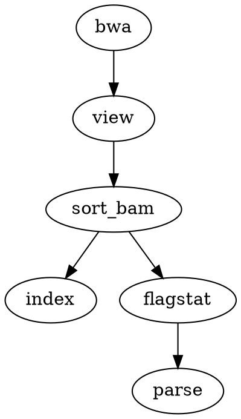

# По пункту 14: Визуализация DAG и отличия от блок-схемы

## Использованный способ визуализации

### Инструменты
| Инструмент            | Назначение |
|-----------------------|------------|
| `cwltool --print-dot` | Генерация DOT-файла из CWL workflow |
| `Graphviz (dot)`      | Конвертация DOT в PNG/SVG |

### Команды для визуализации
```bash
cd ~/bioinf_hw3/cwl
conda activate cwl_env

# Генерация DOT файла
cwltool --print-dot mapping_workflow.cwl > workflow.dot

# Конвертация в изображения
dot -Tpng workflow.dot -o workflow.png
dot -Tsvg workflow.dot -o workflow.svg
```

### Что делает `cwltool --print-dot`
- Анализирует CWL workflow файл
- Определяет все шаги (steps) и их зависимости по данным
- Создаёт описание графа в формате DOT (язык описания графов)
- Узлы — это шаги пайплайна (bwa, view, sort_bam, index, flagstat, parse)
- Рёбра — это зависимости (выход одного шага -> вход другого)

---

## Полученный DAG (Directed Acyclic Graph)

### Текстовое представление
*сокращённо, полное в `cwl_results/workflow.dot`*


### Графическое представление
*сокращённо, полные в `cwl_results/workflow.png` и `cwl_results/workflow.svg`*
```
                    ┌─────────┐
                    │   bwa   │
                    └────┬────┘
                         ↓
                    ┌─────────┐
                    │  view   │
                    └────┬────┘
                         ↓
                    ┌─────────┐
                    │sort_bam │
                    └────┬────┘
                    ┌────┴────┐
                    ↓         ↓
              ┌─────────┐ ┌─────────┐
              │  index  │ │ flagstat│
              └─────────┘ └────┬────┘
                               ↓
                          ┌─────────┐
                          │  parse  │
                          └─────────┘
```

---

## Отличия DAG от блок-схемы алгоритма

### Таблица сравнения

| Характеристика    | Блок-схема                               | DAG |
|-------------------|------------------------------------------|------------------------------|
| **Основная цель** | Описание алгоритма решения задачи        | Оркестрация вычислительных задач |
| **Элементы**      | Операторы (условия, циклы, присваивания) | Вычислительные шаги (инструменты) |
| **Связи**         | Управляющие потоки (if/else, goto)       | Потоки данных (файлы) |
| **Направление**   | Последовательное с ветвлениями           | От входов к выходам (ациклический) |
| **Циклы**         | Возможны (while, for)                    | Запрещены |
| **Параллелизм**   | Требует явного указания                  | Автоматический (независимые шаги) |
| **Переиспользование** | Нет                                  | Да (промежуточные файлы) |

### Конкретные отличия на примере нашего пайплайна

#### 1. Блок-схема (алгоритмический подход)
```
Пусть: reference, R1, R2

1. Запустить bwa mem (reference, R1, R2) ->aligned.sam
2. Запустить samtools view (aligned.sam) ->aligned.bam
3. Запустить samtools sort (aligned.bam) ->aligned.sorted.bam
4. Запустить samtools index (aligned.sorted.bam) ->aligned.sorted.bam.bai
5. Запустить samtools flagstat (aligned.sorted.bam) ->flagstat.txt
6. Запустить python parser (flagstat.txt) ->status, percent
```
**Жёсткая последовательность, шаг за шагом**

#### 2. DAG (поток данных)
```
reference, R1, R2 -> bwa -> sam -> view -> bam -> sort -> sorted.bam ->  flagstat -> flagstat.txt -> parse -> status, percent
                                                                     \-> index -> index.bai
```
Так `index` и `flagstat` могут запуститься параллельно

### Ключевое отличие (самое важное)
**Блок-схема** отвечает на вопрос: **"В каком порядке делать?"**
**DAG** отвечает на вопрос: **"Какие данные нужны для запуска?"**

Пример:
- В блок-схеме: "Сначала сделай index, потом flagstat"
- В DAG: "flagstat требует sorted.bam, index тоже требует sorted.bam — они независимы, можно параллельно"

---

## Преимущества DAG для вычислительных пайплайнов

| Преимущество                   | Описание |
|--------------------------------|----------|
| **Автоматический параллелизм** | Независимые шаги запускаются одновременно |
| **Устойчивость к сбоям**       | Можно перезапустить только упавший шаг |
| **Переиспользование**          | Результаты сохраняются и могут использоваться повторно |
| **Масштабируемость**           | Легко добавлять новые шаги без изменения логики |
| **Декларативность**            | Описываем "что", а не "как" |

---

## Файлы визуализации в репозитории

- `cwl_results/workflow.dot` — исходный DOT файл
- `cwl_results/workflow.png` — растровое изображение
- `cwl_results/workflow.svg` — векторное изображение (рекомендуется для отчётов)

---

## Вывод

DAG — это **поток данных**, а блок-схема — **поток управления**. Для вычислительных пайплайнов DAG удобнее:
1. Позволяет автоматически распараллеливать задачи
2. Упрощает отладку и перезапуск
3. Делает пайплайн модульным и переиспользуемым

В нашем случае CWL автоматически определил, что `index` и `flagstat` независимы, хотя в блок-схеме мы бы их запускали последовательно.
